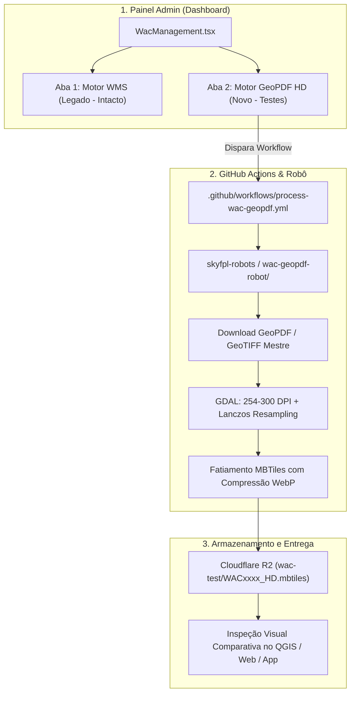

# 📋 Plano de Implementação: Novo Motor de Cartas WAC em Alta Resolução (GeoPDF / HD)

**Data de Criação:** 2026-09-26  
**Status:** Planejado / Aguardando Aprovação para Execução  
**Repositórios Envolvidos:**
- `alfazuluaviation/skyfpl-robots` (Novo robô na pasta `wac-geopdf-robot/`)
- `alfazuluaviation/skynav-pro-a0d215f9` (`admin/src/WacManagement.tsx`)

---

## 🎯 1. Objetivos do Plano

1. **Qualidade Visual Superior (Nível ForeFlight / Garmin Pilot):** Eliminar definitivamente o aspecto borrado/pixelado em zooms reduzidos (Z5 a Z8) através de rasterização em alta definição (254 a 300 DPI) e reamostragem matemática *Lanczos*.
2. **Isolamento Total (Zero Risco):** O robô atual (`wac-robot/`) e a produção continuam 100% operacionais e intocados. O novo robô operará em sua própria pasta e salvará os MBTiles gerados em um diretório de testes isolado no Cloudflare R2 (`wac-hd/` ou `wac-test/`).
3. **Gestão Integrada no Dashboard Admin:** Adicionar uma nova aba na página de gestão de WAC do Dashboard (`skynav-pro-official/admin`), permitindo selecionar cartas específicas para o teste, configurar parâmetros de DPI/algoritmo e monitorar o novo workflow.

---

## 🏗️ 2. Arquitetura da Solução

---

## 🚀 3. Fases de Execução

### Fase 1: Criação do Novo Robô de Testes (`wac-geopdf-robot/`) — ✅ CONCLUÍDA
* **Localização:** Criada a pasta `c:\Users\josemir\Desktop\skyfpl-robots_temp\wac-geopdf-robot/`.
* **Componentes do Robô:**
  1. `requirements.txt`: Dependências Python (`requests`, `boto3`, `pillow`).
  2. `build_wac_geopdf.py`:
     * Download do arquivo mestre em alta definição (GeoTIFF de 254 DPI ou GeoPDF vetorial do AISWEB).
     * Aplicação automática de máscara Alpha na *Neatline* oficial do DECEA (zero margens brancas).
     * Geração de pirâmides com interpolação de alta fidelidade (**Lanczos**).
     * Fatiamento dos tiles com suporte nativo a compressão **WebP** e metadados canônicos.
     * Upload seguro para o bucket R2 no caminho de quarentena (`wac-test/`).
     * Gravação contínua de telemetria em `wac_geopdf_progress.json`.
  3. `wac_catalog.json`: Mapeamento das 46 folhas WAC oficiais do Brasil.
  4. `README.md`: Documentação operacional do motor de testes.
* **Validação de Bancada:** Testado com WAC 3140 gerando MBTiles Z5-Z10 de 4.67 MB sem bordas.

### Fase 2: Workflow de Automação no GitHub Actions — ✅ CONCLUÍDA
* **Localização:** Criado `.github/workflows/process-wac-geopdf.yml`:
  * Disparo manual via `workflow_dispatch` com parâmetros:
    * `chart_codes`: Lista de cartas para o teste (ex: `WAC3140`, `WAC3262` ou `ALL`).
    * `dpi`: Resolução de rasterização (`254` ou `300`).
    * `resampling`: Algoritmo de redução (`lanczos` ou `cubic`).
    * `tile_format`: Formato do tile (`webp` ou `png`).
    * `r2_prefix`: Destino no Cloudflare R2 com quarentena (`wac-test`).
  * Runner Linux com ambiente GDAL nativo (`gdal-bin`, `python3-gdal`, `libgdal-dev`) e Python 3.11.

### Fase 3: Modernização do Dashboard Admin (`WacManagement.tsx`) — ✅ CONCLUÍDA
* **Localização:** `c:\Users\josemir\Desktop\skynav-pro-official\admin\src\WacManagement.tsx`.
* **Implementação da Interface de Dupla Aba:**
  * **Aba 1: `📡 WMS GeoServer (Padrão Atual)`**
    * Mantém 100% dos controles, status e histórico que já funcionam hoje.
  * **Aba 2: `🚀 Motor GeoPDF HD (Alta Resolução - Teste)`**
    * Seletor de cartas WAC com busca rápida em tempo real (46 folhas).
    * Controles de precisão: Seletor de DPI (254 / 300), Interpolação (Lanczos / Cubic) e Formato (WebP / PNG).
    * Card de Telemetria em tempo real do novo robô lendo `wac_geopdf_progress.json` do Cloudflare R2.
    * Botão de disparo direto via API do GitHub Actions no repositório de robôs.
    * Tabela/Cards de MBTiles gerados com link direto para download e cópia de URL.

### Fase 4: Teste Piloto e Comparação A/B — 🔄 PRÓXIMA ETAPA
* Executar o teste com uma carta piloto representativa (ex: **WAC 3140 Brasília** ou **WAC 3262 São Paulo**).
* Realizar a comparação visual lado a lado:
  * MBTiles Legado (WMS DECEA 72 DPI) vs MBTiles Novo (GeoPDF/TIFF HD 254-300 DPI).
  * Inspeção de nitidez nos níveis de zoom Z5, Z6, Z7 e Z8.
  * Auditoria do tamanho do arquivo (MB) e tempo de resposta.

---

## 📂 4. Arquivos que Serão Criados e Modificados

### Repositório de Robôs (`skyfpl-robots`):
* 🆕 `wac-geopdf-robot/build_wac_geopdf.py`
* 🆕 `wac-geopdf-robot/requirements.txt`
* 🆕 `wac-geopdf-robot/README.md`
* 🆕 `.github/workflows/process-wac-geopdf.yml`

### Repositório do Dashboard (`skynav-pro-official/admin`):
* ✏️ `src/WacManagement.tsx` *(Adição do sistema de abas e painel do novo robô)*

---

## 🛡️ 5. Matriz de Riscos e Mitigações

| Risco Potencial | Nível | Medida Mitigatória Adotada |
| :--- | :---: | :--- |
| **Interferência no app em produção** | **Zero** | O novo robô salva em pasta isolada no R2 (`wac-test/`), sem alterar os links consumidos atualmente pelo app e pelo site. |
| **Falha ou quebra no Dashboard atual** | **Zero** | A gestão atual da WAC foi preservada intacta na Aba 1; a Aba 2 é um módulo autônomo e isolado. |
| **Consumo excessivo de memória na geração** | **Baixo** | O GDAL opera com memória virtual mapeada em disco (`TILED=YES` e `BIGTIFF=YES`), processando matrizes de 300 Megapixels sem estourar a RAM do runner. |
