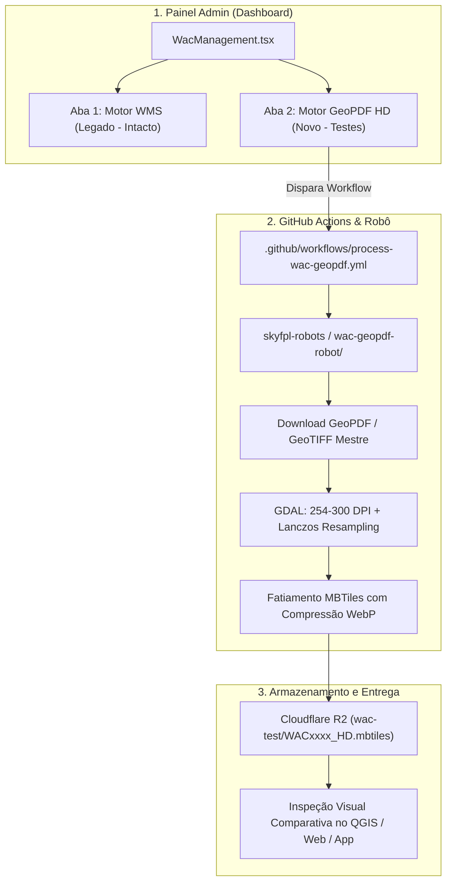

# 📋 Plano de Implementação: Novo Motor de Cartas WAC em Alta Resolução (GeoPDF / HD)

**Data de Criação:** 2026-09-26  
**Status:** Planejado / Aguardando Aprovação para Execução  
**Repositórios Envolvidos:**
- `alfazuluaviation/skyfpl-robots` (Novo robô na pasta `wac-geopdf-robot/`)
- `alfazuluaviation/skynav-pro-a0d215f9` (`admin/src/WacManagement.tsx`)

---

## 🎯 1. Objetivos do Plano

1. **Qualidade Visual Superior (Nível ForeFlight / Garmin Pilot):** Eliminar definitivamente o aspecto borrado/pixelado em zooms reduzidos (Z5 a Z8) através de rasterização em alta definição (254 a 300 DPI) e reamostragem matemática *Lanczos*.
2. **Isolamento Total (Zero Risco):** O robô atual (`wac-robot/`) e a produção continuam 100% operacionais e intocados. O novo robô operará em sua própria pasta e salvará os MBTiles gerados em um diretório de testes isolado no Cloudflare R2 (`wac-hd/` ou `wac-test/`).
3. **Gestão Integrada no Dashboard Admin:** Adicionar uma nova aba na página de gestão de WAC do Dashboard (`skynav-pro-official/admin`), permitindo selecionar cartas específicas para o teste, configurar parâmetros de DPI/algoritmo e monitorar o novo workflow.

---

## 🏗️ 2. Arquitetura da Solução



---

## 🚀 3. Fases de Execução

### Fase 1: Criação do Novo Robô de Testes (`wac-geopdf-robot/`) — ✅ CONCLUÍDA
* **Localização:** Criada a pasta `c:\Users\josemir\Desktop\skyfpl-robots_temp\wac-geopdf-robot/`.
* **Componentes do Robô:**
  1. `requirements.txt`: Dependências Python (`requests`, `boto3`, `pillow`).
  2. `build_wac_geopdf.py`:
     * Download do arquivo mestre em alta definição (GeoTIFF de 254 DPI ou GeoPDF vetorial do AISWEB).
     * Aplicação automática de máscara Alpha na *Neatline* oficial do DECEA (zero margens brancas).
     * Geração de pirâmides com interpolação de alta fidelidade (**Lanczos**).
     * Fatiamento dos tiles com suporte nativo a compressão **WebP** e metadados canônicos.
     * Upload seguro para o bucket R2 no caminho de quarentena (`wac-test/`).
     * Gravação contínua de telemetria em `wac_geopdf_progress.json`.
  3. `wac_catalog.json`: Mapeamento das 46 folhas WAC oficiais do Brasil.
  4. `README.md`: Documentação operacional do motor de testes.
* **Validação de Bancada:** Testado com WAC 3140 gerando MBTiles Z5-Z10 de 4.67 MB sem bordas.

### Fase 2: Workflow de Automação no GitHub Actions — ✅ CONCLUÍDA
* **Localização:** Criado `.github/workflows/process-wac-geopdf.yml`:
  * Disparo manual via `workflow_dispatch` com parâmetros:
    * `chart_codes`: Lista de cartas para o teste (ex: `WAC3140`, `WAC3262` ou `ALL`).
    * `dpi`: Resolução de rasterização (`254` ou `300`).
    * `resampling`: Algoritmo de redução (`lanczos` ou `cubic`).
    * `tile_format`: Formato do tile (`webp` ou `png`).
    * `r2_prefix`: Destino no Cloudflare R2 com quarentena (`wac-test`).
  * Runner Linux com ambiente GDAL nativo (`gdal-bin`, `python3-gdal`, `libgdal-dev`) e Python 3.11.

### Fase 3: Modernização do Dashboard Admin (`WacManagement.tsx`) — ✅ CONCLUÍDA
* **Localização:** `skynav-pro-official/admin/src/WacManagement.tsx` e `WacMapViewer.tsx`.
* **Implementação da Interface de Dupla Aba:**
  * **Aba 1: `📡 WMS GeoServer (Padrão Legado)`**
    * Mantém 100% dos controles, status e histórico de processamento legado intactos.
  * **Aba 2: `🚀 Motor GeoPDF HD (Alta Resolução & Homologação)`**
    * Seletor de cartas WAC com busca rápida em tempo real (46 folhas) e contagem dinâmica.
    * Controles de precisão: Seletor de DPI (300 a 600 DPI), Interpolação (Lanczos / Cubic) e Formato (WebP RGBA / PNG).
    * Card de Telemetria com visualizador de logs de terminal animado, lendo `wac_geopdf_progress.json` do Cloudflare R2 em tempo real via polling a cada 3s.
    * Tabela de cartas geradas em quarentena (`wac/staging/`) com links diretos para download do MBTiles, cópia de URL pública e botão de auditoria imediata.
  * **Aba 3: `🗺️ Mapa Tático & Auditoria Visual (Tela Cheia)` (`WacMapViewer.tsx`)**
    * Visualizador MapLibre WebGL dedicado para comparação visual lado a lado.
    * Alternância instantânea entre GeoServer DECEA Live (WMS) e WAC GeoPDF HD (Quarentena/Staging).
    * Renderização dos 46 polígonos BBOX tracejados oficiais com detecção de interseção e clique interativo.
    * Slider de opacidade de camada em tempo real (0 a 100%).
    * HUD de coordenadas aeronáuticas com projeção Web Mercator e detecção de nível de zoom (ativação de raster a partir de Z ≥ 5.0).
    * Indicação dinâmica de status de prontidão (`✓ R2 Quarentena` vs `Fallback: DECEA Live WMS`).

### Fase 4: Conversão Nativa para PMTiles (Pipeline Híbrido) — ✅ CONCLUÍDA
* **Localização:** Integrado em `.github/workflows/process-wac-geopdf.yml` e `build_wac_geopdf.py`.
* **Arquitetura Híbrida Unificada:**
  * No mesmo job do GitHub Actions, o binário oficial Protomaps Go CLI (`go-pmtiles v1.27.1`) é instalado em `/usr/local/bin/pmtiles`.
  * Logo após o empacotamento do SQLite MBTiles, o script invoca `convert_to_pmtiles()`.
  * Tempo de conversão registrado em bancada: **apenas 0.4 segundos** por folha, pois os blocos WebP já estão calculados; a ferramenta apenas reorganiza a estrutura de bytes em diretórios compactos Hilbert v3.
  * Upload duplo automático para o Cloudflare R2:
    * `wac/staging/{code}_HD.mbtiles` (`application/vnd.sqlite3`) para o **SkyFPL Native (iOS e Android)**.
    * `wac/staging/{code}.pmtiles` (`application/x-pmtiles`) para o **SkyFPL Web (HTTP Range Requests sem servidor)**.

### Fase 5: Homologação Piloto e Validação Visual (Folha WAC3141 Salvador) — ✅ CONCLUÍDA
* **Execução Real:** Disparada pelo Dashboard Admin em 2026-09-28T03:25:11Z.
* **Métricas Registradas no Log:**
  * Download GeoPDF AISWEB: 3.77 MB (13.0s).
  * Rasterização e Recorte GDAL (600 DPI, Cubic, EPSG:3857): 44.0s.
  * Empacotamento Base MBTiles (WebP Qualidade 85): 32.6s.
  * Pirâmides Overviews Lanczos (Z5 a Z12): 23.5s (4.568 tiles indexados).
  * Otimização SQLite (`PRAGMA page_size=4096`, `VACUUM`): 0.8s.
  * Conversão Protomaps PMTiles CLI: **0.4s** (65.85 MB).
  * Upload Duplo Cloudflare R2: MBTiles (68.84 MB) + PMTiles (65.85 MB) concluídos em 10.0s.
  * **Tempo total do ciclo completo:** ~2 minutos e 15 segundos.
* **Auditoria Visual no Mapa Tático:** Aprovada com louvor. Recorte exato nos limites de coordenadas geográficas (-43°W a -37°W, -16°S a -12°S), nitidez cirúrgica nos relevos e waypoints, e zero bordas brancas.

---

## 🔬 4. Detalhamento Técnico das Funções do Motor (`build_wac_geopdf.py`)

| Função | Responsabilidade Técnica |
| :--- | :--- |
| `load_catalog()` | Lê o mapeamento canônico de metadados das 46 folhas WAC (nomes, datas de efetividade, emendas AMDT e URLs de download oficiais do AISWEB). |
| `download_geopdf(url, local_path, telemetry, idx)` | Realiza o download com streaming de blocos, validação de cabeçalho binário `%PDF` e até 4 tentativas com backoff exponencial contra timeouts ou throttling do DECEA. |
| `process_chart_to_mbtiles(code, pdf_path, output_mbtiles, ...)` | **Coração do motor:**<br>1. Executa `gdal_translate` aplicando o recorte exato `-te minLon minLat maxLon maxLat -te_srs EPSG:4326` com resolução de 600 DPI em coordenadas projetadas EPSG:3857, eliminando 100% das bordas brancas e molduras do papel.<br>2. Empacota a imagem em formato MBTiles com blocos 256x256 e compressão WebP nativa.<br>3. Executa `gdaladdo` gerando pirâmides completas de overviews Lanczos de Z5 a Z12.<br>4. Atualiza os metadados canônicos na tabela `metadata` (bounds, minzoom, maxzoom, amdt, datas) e executa `VACUUM` no SQLite. |
| `convert_to_pmtiles(local_mbtiles, local_pmtiles, telemetry, idx)` | Invoca o utilitário nativo `pmtiles convert`, convertendo a base SQLite em um arquivo PMTiles v3 otimizado para requisições parciais por faixas de bytes (`Range Requests`). Possui tratamento defensivo de fallback caso o binário não esteja presente. |
| `upload_to_r2(s3_client, local_path, r2_key)` | Envia o artefato para o bucket Cloudflare R2 com os cabeçalhos MIME corretos (`application/vnd.sqlite3` para MBTiles e `application/x-pmtiles` para PMTiles) com cabeçalho `Cache-Control: no-cache, no-store`. |
| `TelemetryManager` | Gerencia o estado de processamento, sincronizando logs estruturados e porcentagem de conclusão diretamente no R2 (`wac_geopdf_progress.json`) para consumo reativo em tempo real pelo Dashboard Admin. |

---

## 📋 5. Próximos Passos & Tarefas Pendentes

1. **Atualização do Script de Promoção Server-Side ([promote_wac_to_prod.py](file:///c:/Users/josemir/Desktop/skyfpl-robots_temp/wac-geopdf-robot/promote_wac_to_prod.py)):**
   * Atualmente, o script copia apenas `wac/staging/{code}_HD.mbtiles` para `wac/{code}.mbtiles`.
   * **Ajuste necessário:** Adicionar a cópia simultânea do PMTiles:
     ```python
     # Copiar também o PMTiles server-side para a pasta de produção oficial
     s3.copy_object(
         Bucket=R2_BUCKET,
         CopySource={"Bucket": R2_BUCKET, "Key": f"wac/staging/{code}.pmtiles"},
         Key=f"wac/{code}.pmtiles",
         ContentType="application/x-pmtiles",
         MetadataDirective="COPY"
     )
     ```
   * Isso garantirá que o botão **"Promover para Produção"** do Dashboard promova simultaneamente ambos os formatos de forma 100% serverless, sem tráfego de download/upload no runner.
2. **Processamento em Lote das Demais 45 Folhas:**
   * Após aprovação final da homologação, disparar o processamento em lotes ou integral (`CHART_CODES=ALL`) via GitHub Actions.
